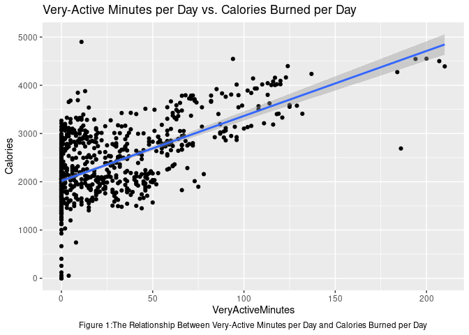
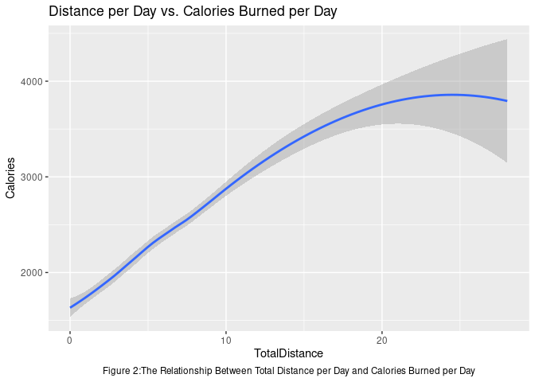
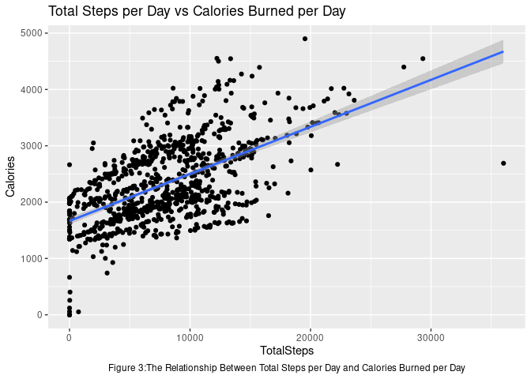

## Introduction and Background
**Bellabeats** is a high-tech manufacturer of health-focused products designed for women. Bellabeats has created an app, alongside several smart devices, in order to help users understand their habits and assist them in making healthy decisions. The company is expanding quickly and has the potential to be a larger player in the global smart device market.

The **Bellabeat app** gives users insight into health data related to their activity, sleep, stress, menstrual cycle, and mindfulness habits. The app connects to the following Bellabeats smart devices to relay health information to the users: **Leaf**, **Time**, and **Spring**. The **Leaf** smart device is a wellness tracker that can be used as a bracelet, a necklace, or a clip. This device tracks the user's activity, sleep, and stress. The **Time** smart device is a smart watch that also tracks activity, sleep, and stress. Lastly, the **Spring** smart device is a smart water bottle that can track daily water intake to notify the user if they are well hydrated throughout the day. Finally, Bellabeats offers a **membership** that is subscription-based, which gives users 24/7 access to a fully personalized plan regarding nutrition, activity, sleep, health and beauty, and mindfulness based on the goals set by the user. 

# Ask
### Define the Business Task:
Analyze FitBit smart device usage data in order to gain insight into consumer trends, which can then support the marketing strategy for Bellabeat's products. This study will focus on improvements to the Bellabeat App and the Time Product.

**Primary Stakeholders:** Urška Sršen & Sando Mur, Bellabeat's cofounders.  
**Secondary Stakeholders:** Bellabeat's marketing analytics team

# Prepare
The data used in this study is sourced from [FitBit Fitness Tracker Data](https://www.kaggle.com/datasets/arashnic/fitbit) In order to be confident in using this data, it must be checked for reliability, originality, comprehensiveness, currency, and for the data's citations. 

The data comes from 33 FitBit users who consented to the submission of personal tracker data. Additionally, the data includes daily, hourly, minute-level, and second-level data about activity, steps, heart rates, intensities, sleep, and more. However, limitations do exist as some data sets contain a small sample size and other data sets only include certain days of the week. Another limitation is that the data is not up to date, the last update was 2 years ago while the metadata states that the update frequency should be yearly. Lastly, there didn't appear to be any citations on the Kaggle data set.

# Process

### Install and Load Packages/Libraries

```r
install.packages("tidyverse")
```

```
## Installing package into '/cloud/lib/x86_64-pc-linux-gnu-library/4.2'
## (as 'lib' is unspecified)
```

```r
library("tidyverse")
```

```
## ── Attaching packages
## ───────────────────────────────────────
## tidyverse 1.3.2 ──
```

```
## ✔ ggplot2 3.3.6     ✔ purrr   0.3.4
## ✔ tibble  3.1.8     ✔ dplyr   1.0.9
## ✔ tidyr   1.2.0     ✔ stringr 1.4.0
## ✔ readr   2.1.2     ✔ forcats 0.5.1
## ── Conflicts ────────────────────────────────────────── tidyverse_conflicts() ──
## ✖ dplyr::filter() masks stats::filter()
## ✖ dplyr::lag()    masks stats::lag()
```
### Upload CSV Files of Interest

```r
daily_activity <- read_csv("dailyActivity_merged.csv", col_types = cols(ActivityDate = col_date(format = "%m/%d/%Y")))
daily_calories <- read_csv("dailyCalories_merged.csv", col_types = cols(ActivityDay = col_date(format = "%m/%d/%Y")))
daily_intensities <- read_csv("dailyIntensities_merged.csv", col_types = cols(ActivityDay = col_date(format = "%m/%d/%Y")))
daily_steps <- read_csv("dailySteps_merged.csv", col_types = cols(ActivityDay = col_date(format = "%m/%d/%Y")))
heartrate_seconds <- read_csv("heartrate_seconds_merged.csv", col_types = cols(Time = col_datetime(format = "%m/%d/%Y %I:%M:%S %p")))
hourly_calories <- read_csv("hourlyCalories_merged.csv", col_types = cols(ActivityHour = col_datetime(format = "%m/%d/%Y %I:%M:%S %p")))
hourly_intensities <- read_csv("hourlyIntensities_merged.csv", col_types = cols(ActivityHour = col_datetime(format = "%m/%d/%Y %I:%M:%S %p")))
hourly_steps <- read_csv("hourlySteps_merged.csv", col_types = cols(ActivityHour = col_datetime(format = "%m/%d/%Y %I:%M:%S %p")))
minute_calories <- read_csv("minuteCaloriesNarrow_merged.csv", col_types = cols(ActivityMinute = col_datetime(format = "%m/%d/%Y %I:%M:%S %p")))
minute_intensities <- read_csv("minuteIntensitiesNarrow_merged.csv", col_types = cols(ActivityMinute = col_datetime(format = "%m/%d/%Y %I:%M:%S %p")))
minute_METs <- read_csv("minuteMETsNarrow_merged.csv", col_types = cols(ActivityMinute = col_datetime(format = "%m/%d/%Y %I:%M:%S %p")))
minute_sleep <- read_csv("minuteSleep_merged.csv", col_types = cols(date = col_datetime(format = "%m/%d/%Y %I:%M:%S %p")))
minute_steps <- read_csv("minuteStepsNarrow_merged.csv", col_types = cols(ActivityMinute = col_datetime(format = "%m/%d/%Y %I:%M:%S %p")))
sleep_day <- read_csv("sleepDay_merged.csv", col_types = cols(SleepDay = col_date(format = "%m/%d/%Y")))
weight_log_info <- read_csv("weightLogInfo_merged.csv", col_types = cols(Date = col_datetime(format = "%m/%d/%Y %I:%M:%S %p")))
```
### Clean Data / Remove Redundant Data Frames If They Exist
The functions **head()**, **colnames()**, and **glimpse()** can be used to explore the data sets in more detail. The function chosen below was the **head()** function, which provides a preview of the data to look for insights and trends.

```r
head(daily_activity)
```

```
## # A tibble: 6 × 15
##           Id ActivityD…¹ Total…² Total…³ Track…⁴ Logge…⁵ VeryA…⁶ Moder…⁷ Light…⁸
##        <dbl> <date>        <dbl>   <dbl>   <dbl>   <dbl>   <dbl>   <dbl>   <dbl>
## 1 1503960366 2016-04-12    13162    8.5     8.5        0    1.88   0.550    6.06
## 2 1503960366 2016-04-13    10735    6.97    6.97       0    1.57   0.690    4.71
## 3 1503960366 2016-04-14    10460    6.74    6.74       0    2.44   0.400    3.91
## 4 1503960366 2016-04-15     9762    6.28    6.28       0    2.14   1.26     2.83
## 5 1503960366 2016-04-16    12669    8.16    8.16       0    2.71   0.410    5.04
## 6 1503960366 2016-04-17     9705    6.48    6.48       0    3.19   0.780    2.51
## # … with 6 more variables: SedentaryActiveDistance <dbl>,
## #   VeryActiveMinutes <dbl>, FairlyActiveMinutes <dbl>,
## #   LightlyActiveMinutes <dbl>, SedentaryMinutes <dbl>, Calories <dbl>, and
## #   abbreviated variable names ¹​ActivityDate, ²​TotalSteps, ³​TotalDistance,
## #   ⁴​TrackerDistance, ⁵​LoggedActivitiesDistance, ⁶​VeryActiveDistance,
## #   ⁷​ModeratelyActiveDistance, ⁸​LightActiveDistance
## # ℹ Use `colnames()` to see all variable names
```

```r
head(daily_calories)
```

```
## # A tibble: 6 × 3
##           Id ActivityDay Calories
##        <dbl> <date>         <dbl>
## 1 1503960366 2016-04-12      1985
## 2 1503960366 2016-04-13      1797
## 3 1503960366 2016-04-14      1776
## 4 1503960366 2016-04-15      1745
## 5 1503960366 2016-04-16      1863
## 6 1503960366 2016-04-17      1728
```

```r
head(daily_intensities)
```

```
## # A tibble: 6 × 10
##           Id ActivityDay Seden…¹ Light…² Fairl…³ VeryA…⁴ Seden…⁵ Light…⁶ Moder…⁷
##        <dbl> <date>        <dbl>   <dbl>   <dbl>   <dbl>   <dbl>   <dbl>   <dbl>
## 1 1503960366 2016-04-12      728     328      13      25       0    6.06   0.550
## 2 1503960366 2016-04-13      776     217      19      21       0    4.71   0.690
## 3 1503960366 2016-04-14     1218     181      11      30       0    3.91   0.400
## 4 1503960366 2016-04-15      726     209      34      29       0    2.83   1.26 
## 5 1503960366 2016-04-16      773     221      10      36       0    5.04   0.410
## 6 1503960366 2016-04-17      539     164      20      38       0    2.51   0.780
## # … with 1 more variable: VeryActiveDistance <dbl>, and abbreviated variable
## #   names ¹​SedentaryMinutes, ²​LightlyActiveMinutes, ³​FairlyActiveMinutes,
## #   ⁴​VeryActiveMinutes, ⁵​SedentaryActiveDistance, ⁶​LightActiveDistance,
## #   ⁷​ModeratelyActiveDistance
## # ℹ Use `colnames()` to see all variable names
```

```r
head(daily_steps)
```

```
## # A tibble: 6 × 3
##           Id ActivityDay StepTotal
##        <dbl> <date>          <dbl>
## 1 1503960366 2016-04-12      13162
## 2 1503960366 2016-04-13      10735
## 3 1503960366 2016-04-14      10460
## 4 1503960366 2016-04-15       9762
## 5 1503960366 2016-04-16      12669
## 6 1503960366 2016-04-17       9705
```

```r
head(heartrate_seconds)
```

```
## # A tibble: 6 × 3
##           Id Time                Value
##        <dbl> <dttm>              <dbl>
## 1 2022484408 2016-04-12 07:21:00    97
## 2 2022484408 2016-04-12 07:21:05   102
## 3 2022484408 2016-04-12 07:21:10   105
## 4 2022484408 2016-04-12 07:21:20   103
## 5 2022484408 2016-04-12 07:21:25   101
## 6 2022484408 2016-04-12 07:22:05    95
```

```r
head(hourly_calories)
```

```
## # A tibble: 6 × 3
##           Id ActivityHour        Calories
##        <dbl> <dttm>                 <dbl>
## 1 1503960366 2016-04-12 00:00:00       81
## 2 1503960366 2016-04-12 01:00:00       61
## 3 1503960366 2016-04-12 02:00:00       59
## 4 1503960366 2016-04-12 03:00:00       47
## 5 1503960366 2016-04-12 04:00:00       48
## 6 1503960366 2016-04-12 05:00:00       48
```

```r
head(hourly_intensities)
```

```
## # A tibble: 6 × 4
##           Id ActivityHour        TotalIntensity AverageIntensity
##        <dbl> <dttm>                       <dbl>            <dbl>
## 1 1503960366 2016-04-12 00:00:00             20            0.333
## 2 1503960366 2016-04-12 01:00:00              8            0.133
## 3 1503960366 2016-04-12 02:00:00              7            0.117
## 4 1503960366 2016-04-12 03:00:00              0            0    
## 5 1503960366 2016-04-12 04:00:00              0            0    
## 6 1503960366 2016-04-12 05:00:00              0            0
```

```r
head(hourly_steps)
```

```
## # A tibble: 6 × 3
##           Id ActivityHour        StepTotal
##        <dbl> <dttm>                  <dbl>
## 1 1503960366 2016-04-12 00:00:00       373
## 2 1503960366 2016-04-12 01:00:00       160
## 3 1503960366 2016-04-12 02:00:00       151
## 4 1503960366 2016-04-12 03:00:00         0
## 5 1503960366 2016-04-12 04:00:00         0
## 6 1503960366 2016-04-12 05:00:00         0
```

```r
head(minute_calories)
```

```
## # A tibble: 6 × 3
##           Id ActivityMinute      Calories
##        <dbl> <dttm>                 <dbl>
## 1 1503960366 2016-04-12 00:00:00    0.786
## 2 1503960366 2016-04-12 00:01:00    0.786
## 3 1503960366 2016-04-12 00:02:00    0.786
## 4 1503960366 2016-04-12 00:03:00    0.786
## 5 1503960366 2016-04-12 00:04:00    0.786
## 6 1503960366 2016-04-12 00:05:00    0.944
```

```r
head(minute_intensities)
```

```
## # A tibble: 6 × 3
##           Id ActivityMinute      Intensity
##        <dbl> <dttm>                  <dbl>
## 1 1503960366 2016-04-12 00:00:00         0
## 2 1503960366 2016-04-12 00:01:00         0
## 3 1503960366 2016-04-12 00:02:00         0
## 4 1503960366 2016-04-12 00:03:00         0
## 5 1503960366 2016-04-12 00:04:00         0
## 6 1503960366 2016-04-12 00:05:00         0
```

```r
head(minute_METs)
```

```
## # A tibble: 6 × 3
##           Id ActivityMinute       METs
##        <dbl> <dttm>              <dbl>
## 1 1503960366 2016-04-12 00:00:00    10
## 2 1503960366 2016-04-12 00:01:00    10
## 3 1503960366 2016-04-12 00:02:00    10
## 4 1503960366 2016-04-12 00:03:00    10
## 5 1503960366 2016-04-12 00:04:00    10
## 6 1503960366 2016-04-12 00:05:00    12
```

```r
head(minute_sleep)
```

```
## # A tibble: 6 × 4
##           Id date                value       logId
##        <dbl> <dttm>              <dbl>       <dbl>
## 1 1503960366 2016-04-12 02:47:30     3 11380564589
## 2 1503960366 2016-04-12 02:48:30     2 11380564589
## 3 1503960366 2016-04-12 02:49:30     1 11380564589
## 4 1503960366 2016-04-12 02:50:30     1 11380564589
## 5 1503960366 2016-04-12 02:51:30     1 11380564589
## 6 1503960366 2016-04-12 02:52:30     1 11380564589
```

```r
head(minute_steps)
```

```
## # A tibble: 6 × 3
##           Id ActivityMinute      Steps
##        <dbl> <dttm>              <dbl>
## 1 1503960366 2016-04-12 00:00:00     0
## 2 1503960366 2016-04-12 00:01:00     0
## 3 1503960366 2016-04-12 00:02:00     0
## 4 1503960366 2016-04-12 00:03:00     0
## 5 1503960366 2016-04-12 00:04:00     0
## 6 1503960366 2016-04-12 00:05:00     0
```

```r
head(sleep_day)
```

```
## # A tibble: 6 × 5
##           Id SleepDay   TotalSleepRecords TotalMinutesAsleep TotalTimeInBed
##        <dbl> <date>                 <dbl>              <dbl>          <dbl>
## 1 1503960366 2016-04-12                 1                327            346
## 2 1503960366 2016-04-13                 2                384            407
## 3 1503960366 2016-04-15                 1                412            442
## 4 1503960366 2016-04-16                 2                340            367
## 5 1503960366 2016-04-17                 1                700            712
## 6 1503960366 2016-04-19                 1                304            320
```

```r
head(weight_log_info)
```

```
## # A tibble: 6 × 8
##           Id Date                WeightKg WeightPo…¹   Fat   BMI IsMan…²   LogId
##        <dbl> <dttm>                 <dbl>      <dbl> <dbl> <dbl> <lgl>     <dbl>
## 1 1503960366 2016-05-02 23:59:59     52.6       116.    22  22.6 TRUE    1.46e12
## 2 1503960366 2016-05-03 23:59:59     52.6       116.    NA  22.6 TRUE    1.46e12
## 3 1927972279 2016-04-13 01:08:52    134.        294.    NA  47.5 FALSE   1.46e12
## 4 2873212765 2016-04-21 23:59:59     56.7       125.    NA  21.5 TRUE    1.46e12
## 5 2873212765 2016-05-12 23:59:59     57.3       126.    NA  21.7 TRUE    1.46e12
## 6 4319703577 2016-04-17 23:59:59     72.4       160.    25  27.5 TRUE    1.46e12
## # … with abbreviated variable names ¹​WeightPounds, ²​IsManualReport
```

### Initial Insights from Previewing Data
After examining the data, it is evident that all data sets can be linked together with a common column "Id". 

Additionally, the Daily Activity data set appears to capture the same information as the Daily Calories, Daily Intensities, and Daily Steps. The purpose of the following code is to confirm that the latter three data sets are redundant and can be removed from analysis. 

First, the sqldf package must be installed and loaded, so that the *INTERSECT* function in *SQL* can be utilized. *INTERSECT* combines two *SELECT* statements and returns only the data set that is common in both statements. After running the *INTERSECT* function between the Daily Activity data set and the three redundant data sets, the **nrow()** function can be used to check that the number of observations are consistent.

```r
install.packages("sqldf")
```

```
## Installing package into '/cloud/lib/x86_64-pc-linux-gnu-library/4.2'
## (as 'lib' is unspecified)
```

```r
library("sqldf")
```

```
## Loading required package: gsubfn
```

```
## Loading required package: proto
```

```
## Warning in fun(libname, pkgname): couldn't connect to display ":0"
```

```
## Loading required package: RSQLite
```
  
  
A temporary data frame must be created to ensure that the number of columns are consistent. This way, the adjusted Daily Activity data set can be compared to the Daily Calories, Daily Intensities, and Daily Steps data sets. First, the Daily Calories data will be compared to the Daily Activity data.

```r
daily_activity1 <- daily_activity %>%
  select(Id, ActivityDate, Calories)
head(daily_activity1)
```

```
## # A tibble: 6 × 3
##           Id ActivityDate Calories
##        <dbl> <date>          <dbl>
## 1 1503960366 2016-04-12       1985
## 2 1503960366 2016-04-13       1797
## 3 1503960366 2016-04-14       1776
## 4 1503960366 2016-04-15       1745
## 5 1503960366 2016-04-16       1863
## 6 1503960366 2016-04-17       1728
```
  
  
Next, the *INTERSECT* function will return data common to both the Daily Activity and the Daily Calories data sets:

```r
daily_calories_check <- sqldf('SELECT * FROM daily_activity1 INTERSECT SELECT * FROM daily_calories')
head(daily_calories_check)
```

```
##           Id ActivityDate Calories
## 1 1503960366   2016-04-12     1985
## 2 1503960366   2016-04-13     1797
## 3 1503960366   2016-04-14     1776
## 4 1503960366   2016-04-15     1745
## 5 1503960366   2016-04-16     1863
## 6 1503960366   2016-04-17     1728
```
  
  
Finally, the number of observations common to both the Daily Activity and the Daily Calories data sets will be checked for consistency:

```r
nrow(daily_activity)
```

```
## [1] 940
```

```r
nrow(daily_calories_check)
```

```
## [1] 940
```
These results show that the Daily Activity data set contains the same information as the daily calories data set.  
  
  
In order to ensure that the Daily Intensities and the Daily Steps data are already included in the Daily Activity data set, the same process will be used.


First, for Daily Intensities, a temporary data frame will be created:

```r
daily_activity2 <- daily_activity %>%
  select(Id, ActivityDate, SedentaryMinutes, LightlyActiveMinutes, FairlyActiveMinutes, VeryActiveMinutes, SedentaryActiveDistance, LightActiveDistance, ModeratelyActiveDistance, VeryActiveDistance)
head(daily_activity2)
```

```
## # A tibble: 6 × 10
##           Id ActivityD…¹ Seden…² Light…³ Fairl…⁴ VeryA…⁵ Seden…⁶ Light…⁷ Moder…⁸
##        <dbl> <date>        <dbl>   <dbl>   <dbl>   <dbl>   <dbl>   <dbl>   <dbl>
## 1 1503960366 2016-04-12      728     328      13      25       0    6.06   0.550
## 2 1503960366 2016-04-13      776     217      19      21       0    4.71   0.690
## 3 1503960366 2016-04-14     1218     181      11      30       0    3.91   0.400
## 4 1503960366 2016-04-15      726     209      34      29       0    2.83   1.26 
## 5 1503960366 2016-04-16      773     221      10      36       0    5.04   0.410
## 6 1503960366 2016-04-17      539     164      20      38       0    2.51   0.780
## # … with 1 more variable: VeryActiveDistance <dbl>, and abbreviated variable
## #   names ¹​ActivityDate, ²​SedentaryMinutes, ³​LightlyActiveMinutes,
## #   ⁴​FairlyActiveMinutes, ⁵​VeryActiveMinutes, ⁶​SedentaryActiveDistance,
## #   ⁷​LightActiveDistance, ⁸​ModeratelyActiveDistance
## # ℹ Use `colnames()` to see all variable names
```
  
  
The *INTERSECT* function is utilized to cross check common data:

```r
daily_intensities_check <- sqldf('SELECT * FROM daily_activity2 INTERSECT SELECT * FROM daily_intensities')
head(daily_intensities_check)
```

```
##           Id ActivityDate SedentaryMinutes LightlyActiveMinutes
## 1 1503960366   2016-04-12              728                  328
## 2 1503960366   2016-04-13              776                  217
## 3 1503960366   2016-04-14             1218                  181
## 4 1503960366   2016-04-15              726                  209
## 5 1503960366   2016-04-16              773                  221
## 6 1503960366   2016-04-17              539                  164
##   FairlyActiveMinutes VeryActiveMinutes SedentaryActiveDistance
## 1                  13                25                       0
## 2                  19                21                       0
## 3                  11                30                       0
## 4                  34                29                       0
## 5                  10                36                       0
## 6                  20                38                       0
##   LightActiveDistance ModeratelyActiveDistance VeryActiveDistance
## 1                6.06                     0.55               1.88
## 2                4.71                     0.69               1.57
## 3                3.91                     0.40               2.44
## 4                2.83                     1.26               2.14
## 5                5.04                     0.41               2.71
## 6                2.51                     0.78               3.19
```
  
  
The number of observations in both data sets are then examined to check for consistency:

```r
nrow(daily_activity)
```

```
## [1] 940
```

```r
nrow(daily_intensities_check)
```

```
## [1] 940
```
These results show that the Daily Activity data set contains the same information as the daily intensities data set.
  
  
Lastly, a temporary data frame will be created for the Daily Activity data to match the columns for the Daily Steps data:

```r
daily_activity3 <- daily_activity %>%
  select(Id, ActivityDate, TotalSteps)
head(daily_activity3)
```

```
## # A tibble: 6 × 3
##           Id ActivityDate TotalSteps
##        <dbl> <date>            <dbl>
## 1 1503960366 2016-04-12        13162
## 2 1503960366 2016-04-13        10735
## 3 1503960366 2016-04-14        10460
## 4 1503960366 2016-04-15         9762
## 5 1503960366 2016-04-16        12669
## 6 1503960366 2016-04-17         9705
```
  
  
The *INTERSECT* function is used to pull all data that is common to both data sets:

```r
daily_steps_check <- sqldf('SELECT * FROM daily_activity3 INTERSECT SELECT * FROM daily_steps')
head(daily_steps_check)
```

```
##           Id ActivityDate TotalSteps
## 1 1503960366   2016-04-12      13162
## 2 1503960366   2016-04-13      10735
## 3 1503960366   2016-04-14      10460
## 4 1503960366   2016-04-15       9762
## 5 1503960366   2016-04-16      12669
## 6 1503960366   2016-04-17       9705
```
  
  
Finally, The number of observations in both data sets are checked for consistency:

```r
nrow(daily_activity)
```

```
## [1] 940
```

```r
nrow(daily_steps_check)
```

```
## [1] 940
```
These results show that the Daily Activity data set contains the same information as the daily steps data set.

  
Based on the information above, all observations in the Daily Calories, Daily Intensities, and Daily Steps data sets are included in the Daily Activity data set. Therefore, the Daily Activity data set will be analyzed, while the other three "Daily" data sets can be removed because they contain duplicate data. 

Due to the large amount of data sets available, Daily Activity, Heart Rate Seconds, Minute METs, Sleep Day, and Weight Log will be examined. Calories, intensities, and Steps are not included because these data points are already represented in the Daily Activity data set.

# Analyze

### Summary of Statistics

Upon analyzing the data, FitBit users average 8,117 steps per day and 2,329 calories burned per day. Further analysis shows that the user's activity level can be broken down into ~13 hours of sedentary living, ~5 hours of lightly active living, ~1/4 hour of fairly active living, and ~1/3 hour of very active living. Users spend, on average, ~7.5 hours per day asleep.


```r
combined_data <- merge(daily_activity, sleep_day, by = "Id")
combined_data %>%
  select( 
         TotalSteps,
         TotalDistance,
         VeryActiveMinutes,
         FairlyActiveMinutes,
         LightlyActiveMinutes,
         SedentaryMinutes,
         Calories,
         TotalMinutesAsleep,
         TotalTimeInBed
         ) %>%
  summary()
```

```
##    TotalSteps    TotalDistance    VeryActiveMinutes FairlyActiveMinutes
##  Min.   :    0   Min.   : 0.000   Min.   :  0.00    Min.   :  0.00     
##  1st Qu.: 4660   1st Qu.: 3.180   1st Qu.:  0.00    1st Qu.:  0.00     
##  Median : 8596   Median : 6.120   Median :  8.00    Median : 10.00     
##  Mean   : 8117   Mean   : 5.735   Mean   : 23.97    Mean   : 17.35     
##  3rd Qu.:11317   3rd Qu.: 7.920   3rd Qu.: 36.00    3rd Qu.: 24.00     
##  Max.   :22988   Max.   :17.950   Max.   :210.00    Max.   :143.00     
##  LightlyActiveMinutes SedentaryMinutes    Calories    TotalMinutesAsleep
##  Min.   :  0.0        Min.   :   0.0   Min.   :   0   Min.   : 58.0     
##  1st Qu.:144.0        1st Qu.: 659.0   1st Qu.:1783   1st Qu.:361.0     
##  Median :200.0        Median : 734.0   Median :2162   Median :432.0     
##  Mean   :199.9        Mean   : 799.2   Mean   :2329   Mean   :419.4     
##  3rd Qu.:258.0        3rd Qu.: 853.0   3rd Qu.:2865   3rd Qu.:492.0     
##  Max.   :518.0        Max.   :1440.0   Max.   :4900   Max.   :796.0     
##  TotalTimeInBed 
##  Min.   : 61.0  
##  1st Qu.:402.0  
##  Median :463.0  
##  Mean   :458.4  
##  3rd Qu.:526.0  
##  Max.   :961.0
```

# Share

### Key Findings:
1. Users spend ~75% of their day in sedentary minutes.


2. There is a positive correlation between the number of very-active minutes of exercise and the total calories burned in day.


3. Another positive correlation is shown between the total distance a user moved in a day and the total calories burned in a day.


4. Another positive correlation exists between the total steps a user takes in a day and the total calories burned in a day.


### Visualizations:

First, let's take a look at activity levels broken down into four different categories: Very Active, Fairly Active, Lightly Active, and Sedentary. To do this, the percentages of each activity level are calculated using the code below:


```r
total <- sum(mean(combined_data$VeryActiveMinutes), mean(combined_data$FairlyActiveMinutes), mean(combined_data$LightlyActiveMinutes), mean(combined_data$SedentaryMinutes))
active_percentage <- mean(combined_data$VeryActiveMinutes)/total
fairly_percentage <- mean(combined_data$FairlyActiveMinutes)/total
lightly_percentage <- mean(combined_data$LightlyActiveMinutes)/total
sedentary_percentage <- mean(combined_data$SedentaryMinutes)/total
```

Once calculations are complete, a pie chart will be created to analyze the duration and intensities of user activity levels. To accomplish this, *plotly* will be installed and loaded into R to draw more insights into the data.


```r
install.packages("plotly")
```

```
## Installing package into '/cloud/lib/x86_64-pc-linux-gnu-library/4.2'
## (as 'lib' is unspecified)
```

```r
library(plotly)
```

```
## 
## Attaching package: 'plotly'
```

```
## The following object is masked from 'package:ggplot2':
## 
##     last_plot
```

```
## The following object is masked from 'package:stats':
## 
##     filter
```

```
## The following object is masked from 'package:graphics':
## 
##     layout
```

```r
pie_data <- data.frame(
  activity = c("Very Active", "Fairly Active", "Lightly Active", "Sedentary"),
  minutes=c(active_percentage, fairly_percentage, lightly_percentage, sedentary_percentage)
)
plot_ly(pie_data, labels = ~activity, values = ~minutes, type = 'pie', 
        textposition = 'inside',  
        insidetextfont = list(color = '#FFFFFF'), 
        marker = list(colors = colors,
                      line = list(color = '#FFFFFF', width = 1)),
        textinfo = 'label+percent')%>%
  layout(title = 'Activity Level Percentages in a Day',
         xaxis = list(showgrid = FALSE, zeroline = FALSE, showticklabels = FALSE),
         yaxis = list(showgrid = FALSE, zeroline = FALSE, showticklabels = FALSE))
```

```{=html}
<div id="htmlwidget-3ca40e36842e019c2f26" style="width:672px;height:480px;" class="plotly html-widget"></div>
<script type="application/json" data-for="htmlwidget-3ca40e36842e019c2f26">{"x":{"visdat":{"14076079967b":["function () ","plotlyVisDat"]},"cur_data":"14076079967b","attrs":{"14076079967b":{"labels":{},"values":{},"textposition":"inside","insidetextfont":{"color":"#FFFFFF"},"marker":{"colors":["function (distinct = FALSE) ","{","    c <- .Call(C_colors)","    if (distinct) ","        c[!duplicated(t(col2rgb(c)))]","    else c","}"],"line":{"color":"#FFFFFF","width":1}},"textinfo":"label+percent","alpha_stroke":1,"sizes":[10,100],"spans":[1,20],"type":"pie"}},"layout":{"margin":{"b":40,"l":60,"t":25,"r":10},"title":"Activity Level Percentages in a Day","xaxis":{"showgrid":false,"zeroline":false,"showticklabels":false},"yaxis":{"showgrid":false,"zeroline":false,"showticklabels":false},"hovermode":"closest","showlegend":true},"source":"A","config":{"modeBarButtonsToAdd":["hoverclosest","hovercompare"],"showSendToCloud":false},"data":[{"labels":["Very Active","Fairly Active","Lightly Active","Sedentary"],"values":[0.0230420211434522,0.0166779718107905,0.19213934530082,0.768140661744937],"textposition":["inside","inside","inside","inside"],"insidetextfont":{"color":"#FFFFFF"},"marker":{"color":"rgba(31,119,180,1)","colors":["structure(function (distinct = FALSE) ","{","    c <- .Call(C_colors)","    if (distinct) ","        c[!duplicated(t(col2rgb(c)))]","    else c","}, apiSrc = TRUE)"],"line":{"color":"#FFFFFF","width":1}},"textinfo":"label+percent","type":"pie","frame":null}],"highlight":{"on":"plotly_click","persistent":false,"dynamic":false,"selectize":false,"opacityDim":0.2,"selected":{"opacity":1},"debounce":0},"shinyEvents":["plotly_hover","plotly_click","plotly_selected","plotly_relayout","plotly_brushed","plotly_brushing","plotly_clickannotation","plotly_doubleclick","plotly_deselect","plotly_afterplot","plotly_sunburstclick"],"base_url":"https://plot.ly"},"evals":[],"jsHooks":[]}</script>
```
After examining the pie chart, it can be noted that FitBit users spend 3/4 of their day being sedentary. 

The CDC recommends 150 minutes per week of fairly-active exercise, 75 minutes per week of very-active exercise, or an equivalent combination to gain both physical and mental health benefits from activity. To compare this information to the data in this study, these totals will be split into daily minutes; Users should have a goal of 21.4 minutes of fairly-active minutes and/or 10.7 minutes of very-active minutes. 

```r
users_hitting_goals <- daily_activity %>%
  filter(FairlyActiveMinutes >= 21.4 | VeryActiveMinutes >= 10.7) %>%
  group_by(Id)
n_distinct(users_hitting_goals$Id)
```

```
## [1] 30
```
30 of the 33 users met the recommendations for fairly-active minutes or very-active minutes. Bellabeat can use these guidelines as standards for their individual users and use a notification system to help improve user interaction. 


Next, let's examine the relationships between minutes, steps, distance, and calories burned. 

Below is a graph showing the relationship between the number of intense minutes of exercise in a day and the amount of calories burned in a day:

```r
ggplot(data=daily_activity, aes(x=VeryActiveMinutes, y=Calories)) +
  geom_point() + 
  stat_smooth(method=lm) + 
  labs(title="Very-Active Minutes per Day vs. Calories Burned per Day", caption="Figure 1:The Relationship Between Very-Active Minutes per Day and Calories Burned per Day") + 
  theme(plot.caption = element_text(hjust=0.5))
```

```
## `geom_smooth()` using formula 'y ~ x'
```

<!-- -->


Figure 1 indicates a correlation between very active minutes and calories burned per day. This information suggest that users who want to burn more calories should spend more time in very active exercise.


Next, is a graph that demonstrates the relationship between the distance an individual has moved throughout a day and the calories burned by a user in a day:

```r
ggplot(data=daily_activity, aes(x=TotalDistance, y=Calories)) + 
  geom_smooth() + 
  labs(title="Distance per Day vs. Calories Burned per Day", caption="Figure 2:The Relationship Between Total Distance per Day and Calories Burned per Day") + 
  theme(plot.caption = element_text(hjust=0.5))
```

```
## `geom_smooth()` using method = 'loess' and formula 'y ~ x'
```

<!-- -->


Figure 2 depicts a positive correlation between total distance and calories burned per day. Bellabeat could use this information to push/notify users to move more throughout the day as more distance correlates to more calories burned.

Last in this sequence of graphs is an illustration that exhibits the relationship between the total number of steps a user takes in one day and the number of calories that a user burns in one day:

```r
ggplot(data=daily_activity, aes(x=TotalSteps, y=Calories)) + 
  geom_point() + 
  stat_smooth(method=lm) + 
  labs(title="Total Steps per Day vs Calories Burned per Day", caption="Figure 3:The Relationship Between Total Steps per Day and Calories Burned per Day") + 
  theme(plot.caption = element_text(hjust=0.5))
```

```
## `geom_smooth()` using formula 'y ~ x'
```

<!-- -->


Figure 3 displays a positive correlation between the user's daily steps per day and calories burned per day. This data indicates that more steps will lead users to burn more calories. Bellabeat can use this information to encourage their users to take more steps throughout the day, especially if the users spend a lot of time in sedentary activity levels.


# Act

### Recommendations for Bellabeat's App/Time Product


1. Bellabeat should improve the user interface and user interaction on their app to get users to be more involved in the online community that Bellabeat creates. 


2. Another suggestion is to include more sharing and communication features to compete with friends and family through the app.


3. Bellabeat might consider suggesting weekly goals that the user defines. The metrics used to set goals should be based on activity levels, distance traveled, and total steps taken since these metrics exhibit a positive correlation with calories burned. Then the app can keep the user accountable by sending notifications when the goals have yet to be accomplished.


4. Another potential to build the Bellabeat brand is to create a notification system that will encourage users to go exercise when the Time product notices long periods of inactivity. This should be an area of focus as most users spend ~75% of their day being sedentary.

## Works Cited:


“How Much Physical Activity Do Adults Need?” Centers for Disease Control and Prevention, Centers for Disease Control and Prevention, 2 June 2022, www.cdc.gov/physicalactivity/basics/adults/index.htm
